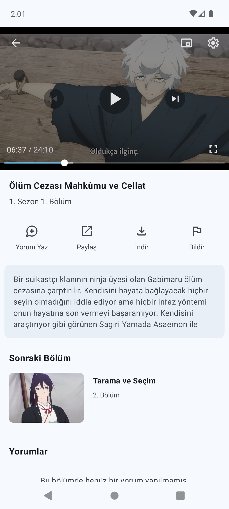
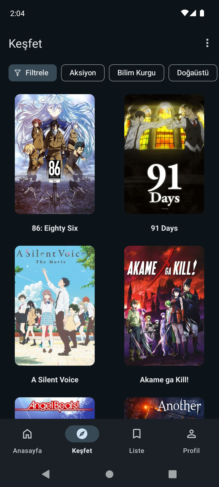

 
<h2 align="center"><b>Anizen</b></h2>
<h4 align="center">Ücretsiz ve reklamsız bir anime izleme uygulaması</h4>

 

## Ekran Görüntüleri

## Hakkında
Anizen, anime izleyicilerinin favori animelerini her zaman ve her yerde izleyebilmeleri için tasarlanmış bir android uygulamasıdır. Bu kullanıcı dostu uygulama, ücretsiz ve reklamsız olmasıyla beraber geniş anime koleksiyonu ve kullanışlı özellikleriyle anime izlemeyi en keyifli hale getiriyor.

Uygulama, kullanıcıların en sevdikleri anime serilerini yüksek kalitede ve kesintisiz bir şekilde izlemelerine olanak tanır. Anizen'in arayüzü sade ve şık tasarımıyla dikkat çekerken, kullanıcılar kolayca istedikleri animeyi bulabilir, kategorilere göz atabilir ve yeni çıkan animeleri takip edebilirler.

### Özellikler
* Şık Arayüz
* Açık, Koyu tema seçeneği
* 100'den fazla anime
* Reklamsız video player
* Kaldığın yerden devam et
* Favorilere ekle
* Yorum yap

## İndir
Anizen'i sayfanın başındaki "Download" butonuna veya [buraya](https://drive.google.com/file/d/19o8-Or_6mig95qTT9kg_VdpBTAmkLmtz/view?usp=drive_link) tıklayarak indirebilirsiniz.
